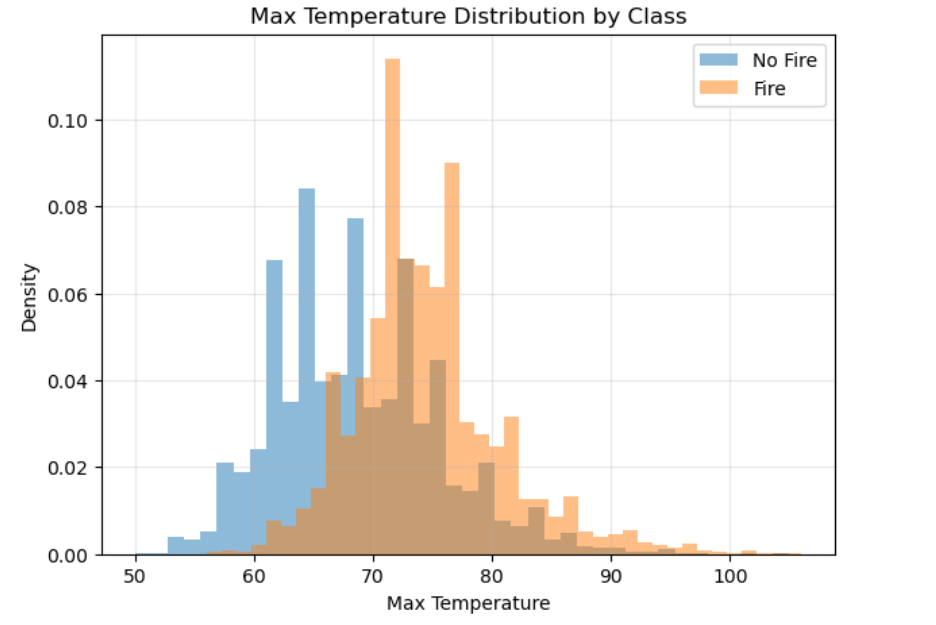
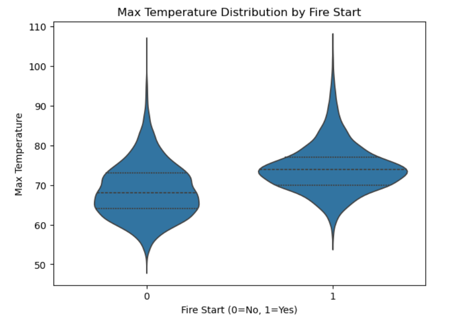
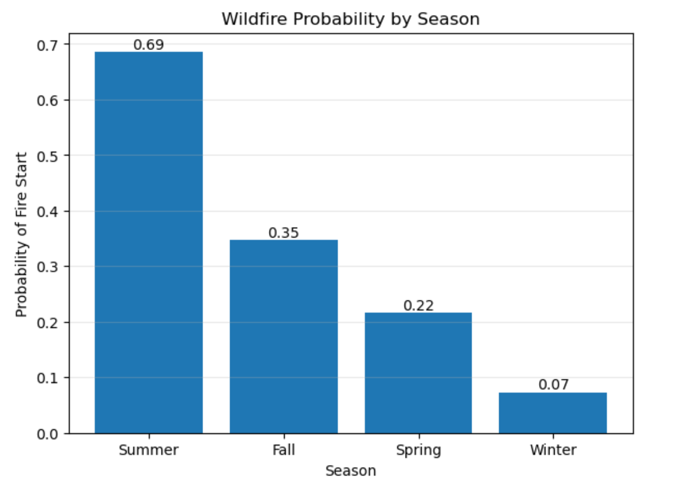
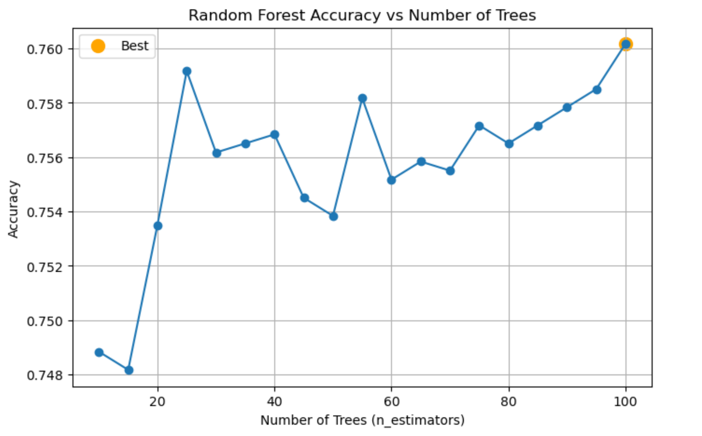
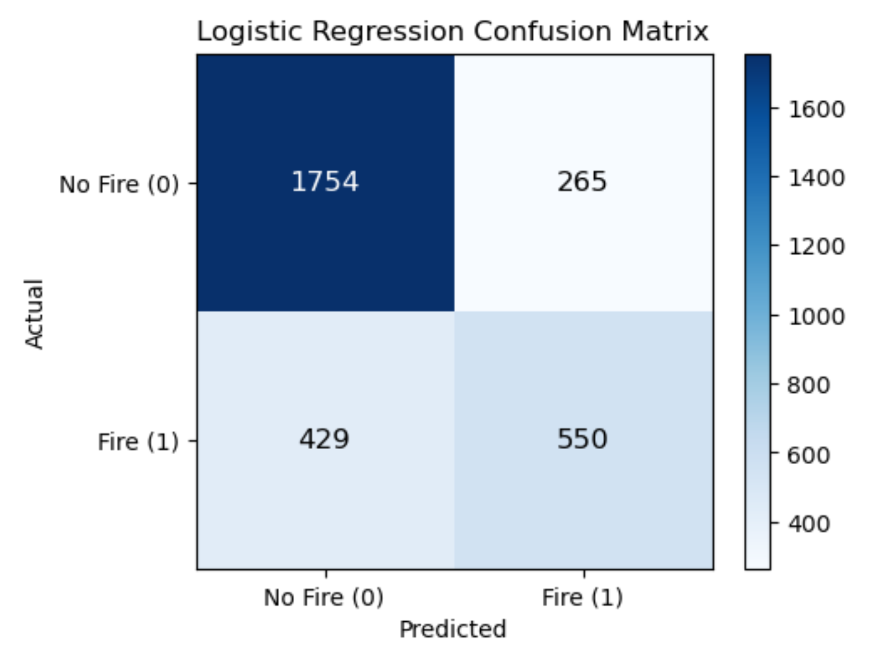
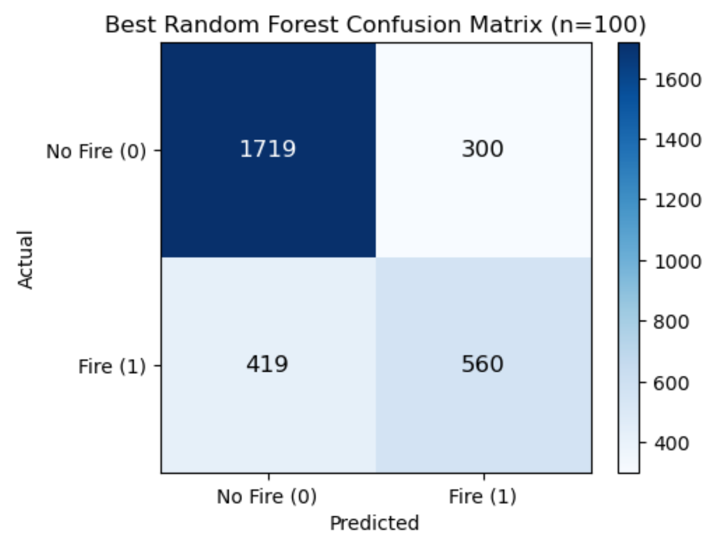
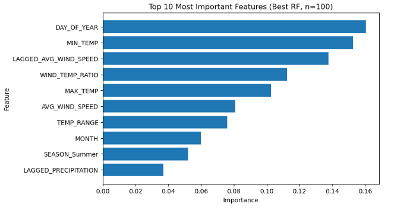

# INFO - B211 | Final Group Project
# California Wildfires Data Analysis

## Overview

This project analyzes the relationship between weather conditions and wildfire occurrence using a real-world dataset from California (1984–2025). The goal is to explore environmental patterns and build machine learning models to predict whether a wildfire will start on a given day.

The project combines **exploratory data analysis (EDA)**, **statistical testing**, and **machine learning** to understand wildfire risk.

---

## Dataset

**Source:** Zenodo  
**Dataset:** California Weather and Fire Prediction Dataset (1984–2025)

The dataset contains daily observations with:

- Temperature (MAX_TEMP, MIN_TEMP, TEMP_RANGE)
- Precipitation
- Wind speed
- Seasonal information
- Lagged weather features
- Fire occurrence (target variable)

### Target Variable
- `FIRE_START_DAY`
  - `0 = No Fire`
  - `1 = Fire`

---
## Libraries and Tools Used

The following Python libraries were used throughout the project:

- **pandas**- data loading and manipulation  
- **numpy** - numerical operations
- **scipy** - statistical testing (t-test analysis)
- **matplotlib** - data visualization  
- **seaborn** - enhanced statistical visualizations  
- **scikit-learn (sklearn)** - machine learning models and evaluation  
  - Logistic Regression  
  - Random Forest Classifier  
  - Train-test split  
  - StandardScaler  
  - Evaluation metrics (accuracy, precision, recall, F1-score, confusion matrix)

### Development Environment
- Python 3.x  
- Jupyter Notebook  

---

## Data Preprocessing

- Dropped unnecessary columns (`DATE`, `YEAR`)
- Converted `SEASON` into numerical features 
- Split dataset into training (80%) and testing (20%)
- Standardized features for Logistic Regression

---

## Descriptive Statistics

To better understand the dataset, key summary statistics were analyzed for all major features.

### Key Observations:

- **Temperature**
  - Average max temperature: ~70.5°F  
  - Average min temperature: ~56.5°F  
  - Range: 50°F → 106°F (max temp), 33°F → 77°F (min temp)  
  --> Indicates strong seasonal variability

- **Precipitation**
  - Mean: ~0.03 inches  
  - Median: 0 inches  
  - Max: 4.53 inches  
  --> Highly skewed, with many dry days (important for wildfire risk)

- **Wind Speed**
  - Average: ~7.4 mph  
  - Range: ~1.8 → 26.2 mph  
  --> Shows occasional strong wind conditions

- **Temporal Features**
  - Data spans: **1984 - 2025**
  - Month ranges from 1-12
  - Day of year: 1-366  
  --> Captures full seasonal cycles

- **Engineered Features**
  - Temperature range: average ~14°F (up to 41°F)
  - Wind-temp ratio: average ~0.107
  - Lagged precipitation: average ~0.226 inches
  - Lagged wind speed: average ~7.43 mph  

These statistics highlight the variability, skewness, and seasonal nature of the dataset, which are critical factors in wildfire prediction.

## Exploratory Data Analysis

### Fire vs Non-Fire Distribution

     
    <b>Figure 1.</b> Distribution of wildfire vs non-fire days.

Wildfires occur less frequently, indicating class imbalance.

---

### Temperature vs Fire

     
    <b>Figure 2.</b> Maximum temperature distribution by class.

Fire days are associated with higher temperatures.

---

### Seasonal Trends

     
    <b>Figure 4.</b> Wildfire occurrences by season.

Wildfires peak during summer months.

---

## Statistical Testing

Welch’s t-tests confirm:

- **Temperature** is significantly higher on fire days  
- **Precipitation** is significantly lower on fire days  

These differences are statistically significant.

---

## Machine Learning Models

### Logistic Regression
- Baseline model
- Requires feature scaling
- Interpretable

### Random Forest
- Captures nonlinear relationships
- Handles feature interactions
- No scaling required

---

## Hyperparameter Tuning

Random Forest was tuned using:

- `n_estimators` from **10 to 100 (step = 5)**

     
    <b>Figure 5.</b> Random Forest accuracy vs number of trees.

Accuracy stabilizes as tree count increases. Best performance at **n = 100**.

---

## Model Performance

| Model | Accuracy | Precision | Recall | F1 Score |
|------|--------|----------|--------|------|
| Logistic Regression | 0.769 | 0.675 | 0.562 | 0.613 |
| Random Forest (n=100) | 0.760 | 0.651 | 0.572 | 0.609 |

### Key Observations
- Both models achieve similar accuracy (~76%)
- Logistic Regression → higher precision (fewer false alarms)
- Random Forest → higher recall (detects more fires)
- Trade-off between precision and recall

---

##  Confusion Matrices

     
    <b>Figure 6.</b> Logistic Regression confusion matrix.

     
    <b>Figure 7.</b> Random Forest confusion matrix (best model).

Random Forest detects more fires but produces more false positives.

---

## Feature Importance (Random Forest)

     
    <b>Figure 8.</b> Top 10 most important features.

### Most Important Features:
- DAY_OF_YEAR (seasonality)
- MIN_TEMP
- LAGGED_AVG_WIND_SPEED
- MAX_TEMP

---

## Key Insights

- Higher temperatures increase wildfire risk  
- Lower precipitation strongly correlates with fires  
- Wildfires are highly seasonal  
- Models show moderate predictive performance  

---

## Limitations

- Only weather data used (missing vegetation, terrain, human factors)
- Moderate recall → there are some fires that are missed
- Strong reliance on seasonal patterns
- Limited generalization capability

---

## Future Improvements

- Incorporate vegetation and satellite data  
- Add geographic and human activity features  
- Explore advanced models  
- Improve feature engineering  

---

## Conclusion

Weather variables can help predict wildfire occurrence, particularly temperature, precipitation, and seasonal patterns. However, wildfire prediction remains a complex problem requiring richer datasets (with more features) and more advanced modeling approaches.
